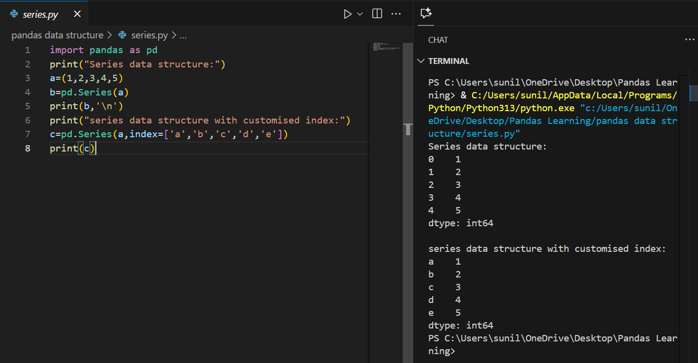
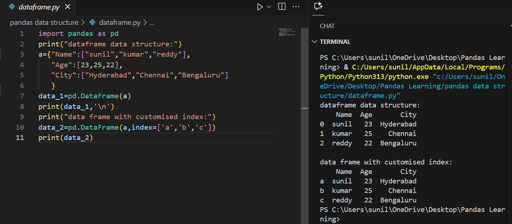

# 🐼 Pandas Data Structures – Hands-on Tasks

This repository is a structured guide to mastering **Pandas data structures** – the building blocks of data analysis in Python.

It features **2 beginner-friendly tasks**, starting from Series creation to working with DataFrames and custom indexes.  
Perfect for learners who want to build a strong foundation in **Pandas** and data handling.

---

## 📂 Task Progression: Beginner ➡️ Essential

| 🧪 Task File                                                | 📄 Description                                    | 📷 Output Screenshot |
|-------------------------------------------------------------|--------------------------------------------------|----------------------|
| [series.py](pandas%20data%20structure/series.py)            | 🎯 Creating a Pandas Series (default & custom index) |  |
| [dataframe.py](pandas%20data%20structure/dataframe.py)      | ✅ Creating a Pandas DataFrame (default & custom index) |  |

---

## ✅ What I Practiced

- Creating a **Series** from tuples  
- Using **default and custom indexes** in Series  
- Creating a **DataFrame** from dictionary data  
- Working with **custom row indexes** in DataFrames  
- Understanding the difference between **Series (1D)** and **DataFrame (2D)**  

---

## 👨‍💻 About Me

📊 **Sunil Kumar Reddy Punnati**  
🎓 MCA Graduate | 💼 Data Analyst Intern  
📍 Tirupati, India  

💡 Passionate about **Python, Pandas, NumPy, Data Analysis**, and building impactful projects.  
🚀 Actively preparing for full-time roles in **Data Analytics & Software Development**.

---

## 🔗 Connect With Me
🌐 [LinkedIn](https://www.linkedin.com/in/sunil-kumar-reddy-punnati-a0a279308/)  
💻 [GitHub](https://github.com/sunilkumarreddypunnati)  

---

## 🙌 Connect & Support

If you’re a recruiter, mentor, or fellow learner — let’s connect and grow together!  
⭐ Star this repo if you found it helpful or inspiring.

---

## ℹ️ Summary

A curated set of **2 Pandas beginner tasks** that cover the core **data structures in Pandas**.  
Each task includes **Python code, explanations, and output screenshots** to help learners practice and gain confidence in data handling.

---

### 📊 Languages
- Python (100%)
